---
K8s v1.18 ~ v1.29 适用 · Java 开发者视角**

---

## 第一章 Kubernetes 概述

### 1.1 什么是 Kubernetes

Kubernetes（简称 **K8s**）是 Google 于 2014 年开源的容器编排系统，源于 Google 内部的 Borg 系统，现由 CNCF（云原生计算基金会）维护。其名称来自希腊语，意为"舵手"，K8s 是将中间 8 个字母省略后的缩写。

Kubernetes 的本质是一组服务器集群，在集群每个节点上运行特定程序，对节点中的容器进行管理，目标是**实现资源管理的自动化**。

### 1.2 核心功能

<CardGrid>
  <Card title="🔄 自我修复" icon="refresh">
    容器崩溃后，能在 1 秒内迅速重启新容器，保持期望副本数
  </Card>
  <Card title="📈 弹性伸缩" icon="rocket">
    根据负载自动调整集群中运行的容器数量（HPA / VPA）
  </Card>
  <Card title="🌐 服务发现" icon="information">
    Service 提供稳定的 ClusterIP 并自动实现请求负载均衡
  </Card>
  <Card title="↩️ 版本回退" icon="warning">
    发现问题可立即回退到上一个 Deployment 版本
  </Card>
  <Card title="💾 存储编排" icon="document">
    自动挂载 NFS、云存储、本地存储等持久化卷
  </Card>
  <Card title="⚙️ 配置管理" icon="setting">
    ConfigMap / Secret 统一管理应用配置，与镜像解耦
  </Card>
</CardGrid>

### 1.3 K8s 与 Docker 的关系

| 维度 | Docker | Kubernetes |
|------|--------|------------|
| 定位 | 容器运行时（创建/运行容器） | 容器编排平台（管理大量容器） |
| 单机/集群 | 单机为主 | 天然集群管理 |
| 网络 | Bridge 网络 | CNI 插件（Flannel/Calico） |
| 存储 | Volumes | PV/PVC 抽象层 |
| 服务发现 | Link（已废弃） | Service + DNS（CoreDNS） |

### 1.4 应用场景

- 微服务应用编排与管理
- CI/CD 持续部署流水线
- 混合云 / 多云部署
- 有状态应用（数据库集群）托管
- 机器学习任务调度

---

## 第二章 集群架构

### 2.1 整体架构图

K8s 采用 **Master-Worker 主从架构**，以下是完整的集群组件交互图：

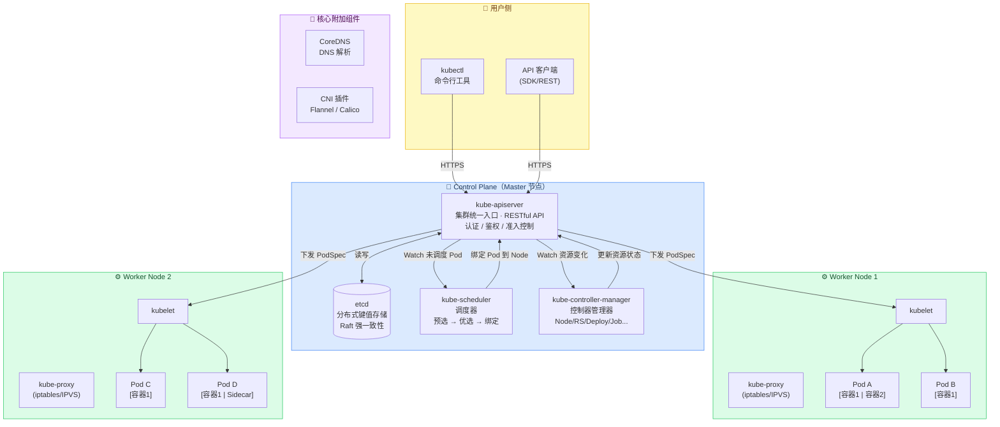

### 2.2 Master 节点组件详解

#### 2.2.1 kube-apiserver

集群统一入口，提供 RESTful API。所有组件（kubectl、Scheduler、Controller 等）只能通过 API Server 操作资源，API Server 负责**认证、鉴权、准入控制**。

<Aside type="tip" title="关键设计">
API Server 是唯一直接读写 etcd 的组件，其他组件通过 **List-Watch 机制**感知资源变化，实现松耦合。
</Aside>

#### 2.2.2 etcd

分布式键值存储，保存集群所有状态数据（Pod、Service、ConfigMap 等的定义）。使用 **Raft 算法**保证强一致性。生产环境建议独立部署 etcd 集群（奇数节点，至少 3 个）。

<Aside type="caution" title="生产注意">
etcd 是集群的大脑，务必做好定期备份：`etcdctl snapshot save backup.db`
</Aside>

#### 2.2.3 kube-scheduler

负责监听未绑定 Node 的 Pod，根据调度算法选择最优 Node 并完成绑定。调度分两个阶段：

- **Predicate（预选）**：过滤不满足条件的节点（资源不足、污点不匹配等）
- **Priority（优选）**：对候选节点打分，选择得分最高的节点

#### 2.2.4 kube-controller-manager

运行各种控制器，每个控制器通过 List-Watch 监听资源变化，使集群实际状态趋近期望状态：

| 控制器 | 职责 |
|--------|------|
| Node Controller | 监控节点健康，节点不可达时设置 Pod Condition |
| ReplicaSet Controller | 维持 Pod 副本数 |
| Deployment Controller | 管理滚动更新 |
| Endpoints Controller | 维护 Service 与 Pod 的端点关系 |
| Namespace Controller | 管理命名空间生命周期 |
| Job Controller | 管理 Job / CronJob 执行 |

### 2.3 Worker 节点组件

| 组件 | 职责 |
|------|------|
| **kubelet** | Node 上的 Agent，接收 PodSpec、管理容器生命周期、执行健康检查 |
| **kube-proxy** | 维护 iptables/IPVS 规则，实现 Service 负载均衡与 NAT 转发 |
| **Container Runtime** | 拉取镜像、创建容器（通过 CRI 接口：containerd / CRI-O） |

### 2.4 附加组件（Add-ons）

| 组件 | 作用 |
|------|------|
| CoreDNS | 集群内 DNS 解析，Service 名 → ClusterIP |
| Flannel / Calico | Pod 网络（CNI 插件），实现跨节点 Pod 通信 |
| Ingress Controller | 七层 HTTP/HTTPS 流量入口（Nginx/Traefik） |
| Dashboard | Web UI 管理界面 |
| Metrics Server | 资源监控数据，HPA 所依赖 |
| Prometheus + Grafana | 监控告警体系 |

---

## 第三章 核心资源对象

### 3.1 Pod

#### 3.1.1 Pod 基本概念

Pod 是 K8s **最小调度单位**，一个 Pod 内可以运行一个或多个容器，共享同一个 Network Namespace（IP 地址）、UTS Namespace（主机名）和 Volume。

- 同 Pod 内容器通过 `localhost` 互相访问
- Pod 是临时性的，重启后 IP 会变化，不应直接依赖 Pod IP
- 一般一个 Pod 只运行一个业务容器 + 可能的 Sidecar 容器

#### 3.1.2 Pod 生命周期状态机

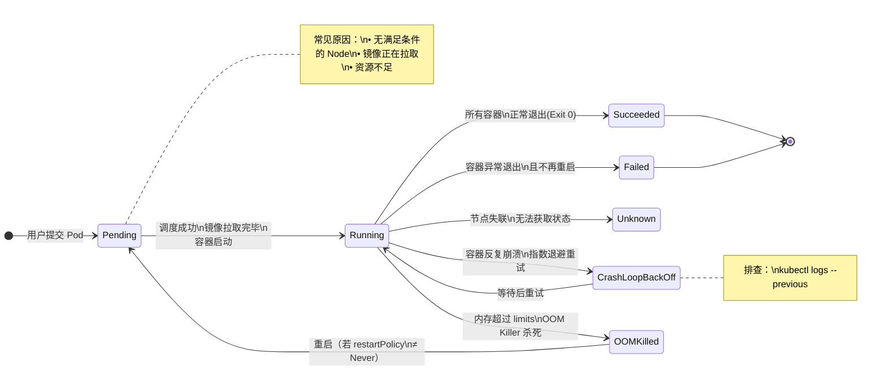

#### 3.1.3 Pod 重启策略（restartPolicy）

| 策略 | 含义 | 适用场景 |
|------|------|---------|
| `Always`（默认） | 容器退出后总是重启 | 长期运行的服务（Deployment） |
| `OnFailure` | 仅在容器异常退出时重启 | Job / 批处理任务 |
| `Never` | 从不重启 | 一次性任务，需要手动检查结果 |

#### 3.1.4 Pod YAML 结构

```yaml
apiVersion: v1
kind: Pod
metadata:
  name: my-pod
  namespace: default
  labels:
    app: my-app
spec:
  containers:
  - name: my-container
    image: nginx:1.21
    ports:
    - containerPort: 80
    resources:
      requests:
        cpu: '100m'
        memory: '128Mi'
      limits:
        cpu: '500m'
        memory: '256Mi'
    env:
    - name: ENV_VAR
      value: 'hello'
    livenessProbe:
      httpGet:
        path: /health
        port: 80
      initialDelaySeconds: 30
      periodSeconds: 10
    readinessProbe:
      httpGet:
        path: /ready
        port: 80
      initialDelaySeconds: 5
      periodSeconds: 5
```

#### 3.1.5 健康检查探针

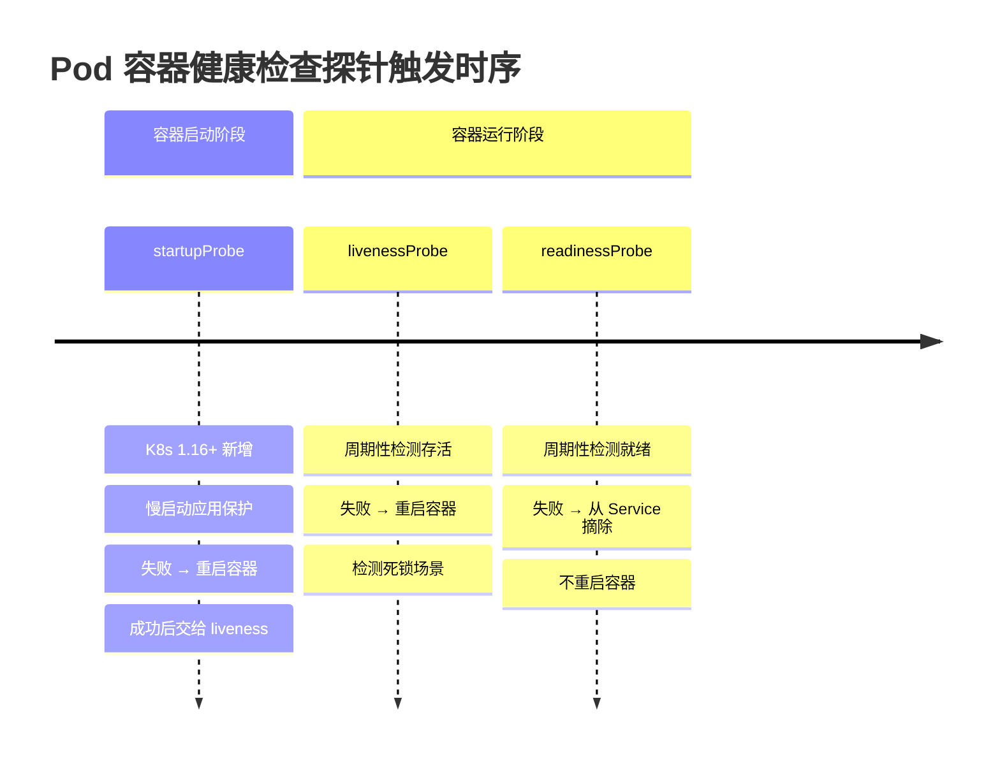

**检查方式：**`httpGet` / `tcpSocket` / `exec`（执行命令）

#### 3.1.6 Init Container（初始化容器）

Init Container 在应用容器启动**之前**按顺序依次执行，全部成功后主容器才启动。常用于依赖检测、配置生成、文件初始化等场景。

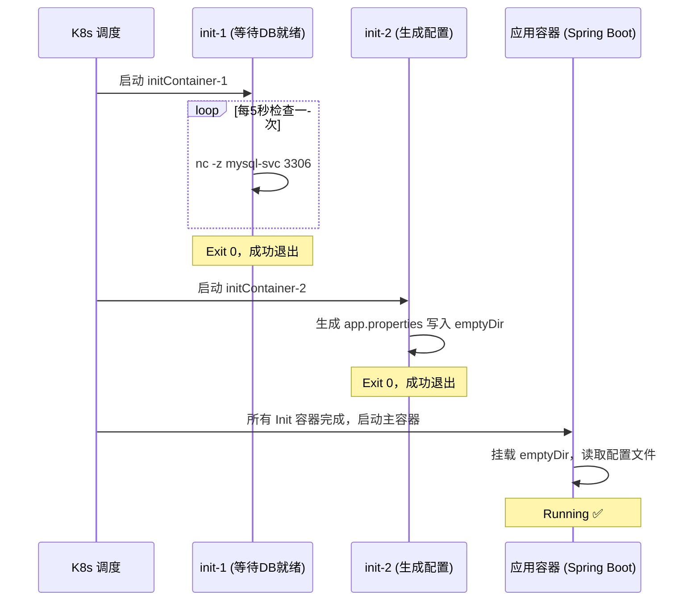

```yaml
spec:
  initContainers:
  - name: wait-for-db
    image: busybox
    command: ['sh', '-c', 'until nc -z mysql-svc 3306; do echo waiting; sleep 5; done']
  - name: init-config
    image: busybox
    command: ['sh', '-c', 'echo "db.host=mysql-svc" > /config/app.properties']
    volumeMounts:
    - name: config-vol
      mountPath: /config
  containers:
  - name: app
    image: my-spring-app:1.0
    volumeMounts:
    - name: config-vol
      mountPath: /app/config
  volumes:
  - name: config-vol
    emptyDir: {}
```

<Aside type="tip" title="Init vs Sidecar">
**Init Container** 串行执行，执行完退出，主容器启动后不再运行。**Sidecar Container**（K8s 1.29+ 正式支持）与主容器同生命周期，用于日志采集、服务网格代理等长期辅助功能。
</Aside>

### 3.2 Deployment

Deployment 是**无状态应用**的首选控制器，管理 ReplicaSet，进而管理 Pod 副本，支持滚动更新和版本回退。

#### 3.2.1 Deployment 层级关系

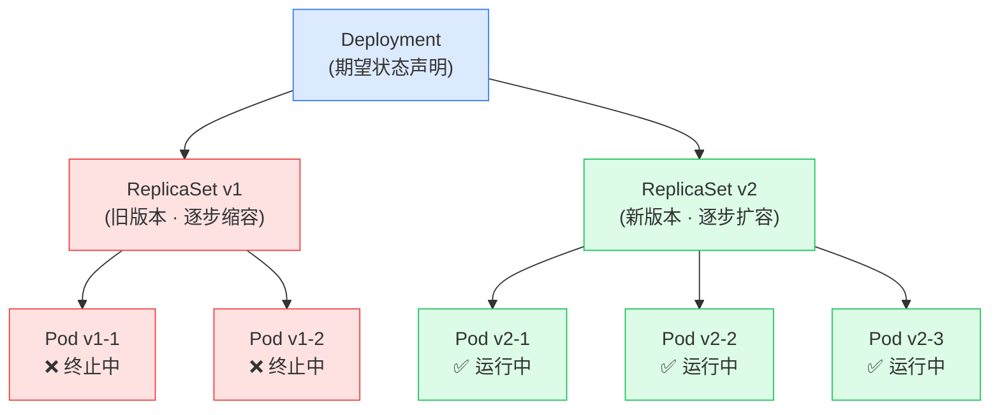

#### 3.2.2 常用操作

```bash
# 创建 Deployment
kubectl create deployment nginx --image=nginx:1.21 --replicas=3

# 扩缩容
kubectl scale deployment nginx --replicas=5

# 更新镜像（触发滚动更新）
kubectl set image deployment/nginx nginx=nginx:1.22

# 查看更新状态
kubectl rollout status deployment/nginx

# 查看历史版本（需在 apply 时加 --record 或手动注解）
kubectl rollout history deployment/nginx

# 回退到上一版本
kubectl rollout undo deployment/nginx

# 回退到指定版本
kubectl rollout undo deployment/nginx --to-revision=2
```

#### 3.2.3 更新策略（strategy）

| 策略 | 说明 | 停机时间 |
|------|------|---------|
| `RollingUpdate`（默认） | 逐步替换旧 Pod，`maxSurge` / `maxUnavailable` 控制节奏 | 无 |
| `Recreate` | 先删除所有旧 Pod，再创建新 Pod | 有 |

<Aside type="tip">
`maxSurge=25%`（允许超出期望副本数的比例），`maxUnavailable=25%`（最多不可用 Pod 比例）。建议生产环境设为 `maxSurge=1, maxUnavailable=0` 保证服务不中断。
</Aside>

### 3.3 StatefulSet

有状态应用（MySQL、Redis 集群、Kafka）的控制器：

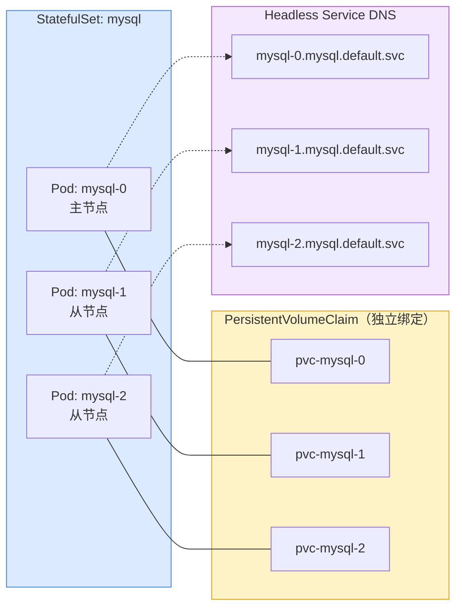

**核心特性：**
- **稳定网络标识**：Pod 名固定（pod-0、pod-1），重调度后不变
- **稳定存储**：每个 Pod 绑定独立 PVC，重建后复用相同 PVC
- **有序操作**：按 0、1、2 顺序部署/扩缩/删除
- 需配套 **Headless Service**（`clusterIP: None`）

### 3.4 DaemonSet

保证集群中每个（或指定）节点都运行一个 Pod 副本：

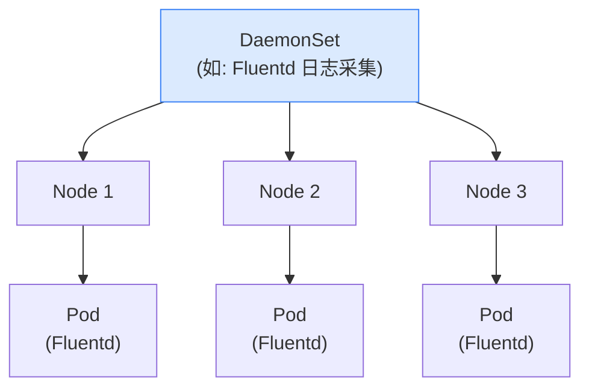

**常用场景：** 日志采集（Fluentd / Filebeat）、监控 Agent（Node Exporter）、网络插件（Flannel / Calico）

### 3.5 Job 与 CronJob

| 资源 | 用途 | 完成条件 |
|------|------|---------|
| **Job** | 一次性任务（数据迁移/批量计算） | 指定数量 Pod 成功退出（Exit 0） |
| **CronJob** | 定时任务（定期清理/报表生成） | 按 cron 表达式周期触发 Job |

#### Job 关键参数

| 参数 | 说明 | 默认值 |
|------|------|-------|
| `completions` | 需要成功完成的 Pod 总数 | 1 |
| `parallelism` | 同时运行的最大 Pod 数 | 1 |
| `backoffLimit` | 失败重试次数上限（超过则 Job Failed） | 6 |
| `activeDeadlineSeconds` | Job 最大执行时长（超时则终止） | 无限制 |
| `ttlSecondsAfterFinished` | Job 完成后自动删除的等待秒数 | 不自动删除 |

```yaml
# Job 示例：并行处理 10 个任务，每次最多 3 个并发
apiVersion: batch/v1
kind: Job
metadata:
  name: data-migration
spec:
  completions: 10          # 需要 10 个 Pod 成功
  parallelism: 3           # 同时最多 3 个并发
  backoffLimit: 4          # 最多重试 4 次
  ttlSecondsAfterFinished: 300  # 完成后 5 分钟自动清理
  template:
    spec:
      containers:
      - name: worker
        image: my-migration-job:1.0
        command: ['python', 'migrate.py']
      restartPolicy: OnFailure
```

```yaml
# CronJob 示例（每天凌晨 2 点执行清理任务）
apiVersion: batch/v1
kind: CronJob
metadata:
  name: daily-cleanup
spec:
  schedule: '0 2 * * *'          # 分 时 日 月 周
  concurrencyPolicy: Forbid       # Forbid=禁止并发 | Allow=允许 | Replace=替换旧任务
  successfulJobsHistoryLimit: 3   # 保留最近 3 次成功记录
  failedJobsHistoryLimit: 1       # 保留最近 1 次失败记录
  jobTemplate:
    spec:
      template:
        spec:
          containers:
          - name: cleanup
            image: busybox
            command: ['/bin/sh', '-c', 'echo cleaning up old data...']
          restartPolicy: OnFailure
```

### 3.6 HorizontalPodAutoscaler（HPA）

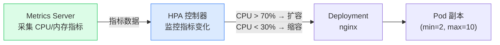

```bash
kubectl autoscale deployment nginx --min=2 --max=10 --cpu-percent=70
```

HPA YAML 示例（`autoscaling/v2` 支持多指标）：

```yaml
apiVersion: autoscaling/v2
kind: HorizontalPodAutoscaler
metadata:
  name: nginx-hpa
spec:
  scaleTargetRef:
    apiVersion: apps/v1
    kind: Deployment
    name: nginx
  minReplicas: 2
  maxReplicas: 10
  metrics:
  - type: Resource
    resource:
      name: cpu
      target:
        type: Utilization
        averageUtilization: 70    # CPU 使用率超过 70% 则扩容
  - type: Resource
    resource:
      name: memory
      target:
        type: AverageValue
        averageValue: 200Mi       # 内存均值超过 200Mi 则扩容
  behavior:
    scaleUp:
      stabilizationWindowSeconds: 60    # 扩容冷静期：60s 内不反复扩
    scaleDown:
      stabilizationWindowSeconds: 300   # 缩容冷静期：5 分钟防止抖动
```

### 3.7 VerticalPodAutoscaler（VPA）

VPA 自动调整单个 Pod 容器的 **CPU/内存 requests**，解决 HPA 无法处理的"单个 Pod 规格不合适"问题。

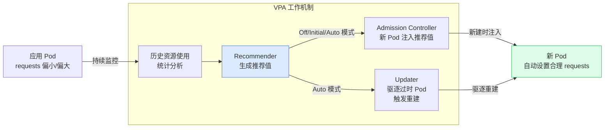

| VPA 更新模式 | 行为 |
|-------------|------|
| `Off` | 只生成推荐值，不自动修改（纯分析模式） |
| `Initial` | 仅在 Pod **创建时**注入推荐值，不驱逐旧 Pod |
| `Recreate` | 驱逐不符合推荐值的 Pod，触发重建（有短暂中断） |
| `Auto` | 当前等同 `Recreate`，未来可能支持原地更新 |

```yaml
apiVersion: autoscaling.k8s.io/v1
kind: VerticalPodAutoscaler
metadata:
  name: nginx-vpa
spec:
  targetRef:
    apiVersion: apps/v1
    kind: Deployment
    name: nginx
  updatePolicy:
    updateMode: "Auto"          # 自动驱逐重建
  resourcePolicy:
    containerPolicies:
    - containerName: nginx
      minAllowed:               # 推荐值下限
        cpu: 100m
        memory: 50Mi
      maxAllowed:               # 推荐值上限
        cpu: 2
        memory: 2Gi
```

<Aside type="caution" title="HPA 与 VPA 不可同时基于 CPU/内存">
HPA 和 VPA 若都针对同一指标（如 CPU）会互相冲突。推荐组合：**VPA 管理内存**（难以水平扩展的资源）+ **HPA 管理 CPU/自定义指标**（或二者各管不同维度）。
</Aside>

---

## 第四章 网络

### 4.1 Service

Service 为一组 Pod 提供**稳定的网络入口**（ClusterIP），通过 **Label Selector** 匹配后端 Pod。

#### 4.1.1 Service 类型与流量路径

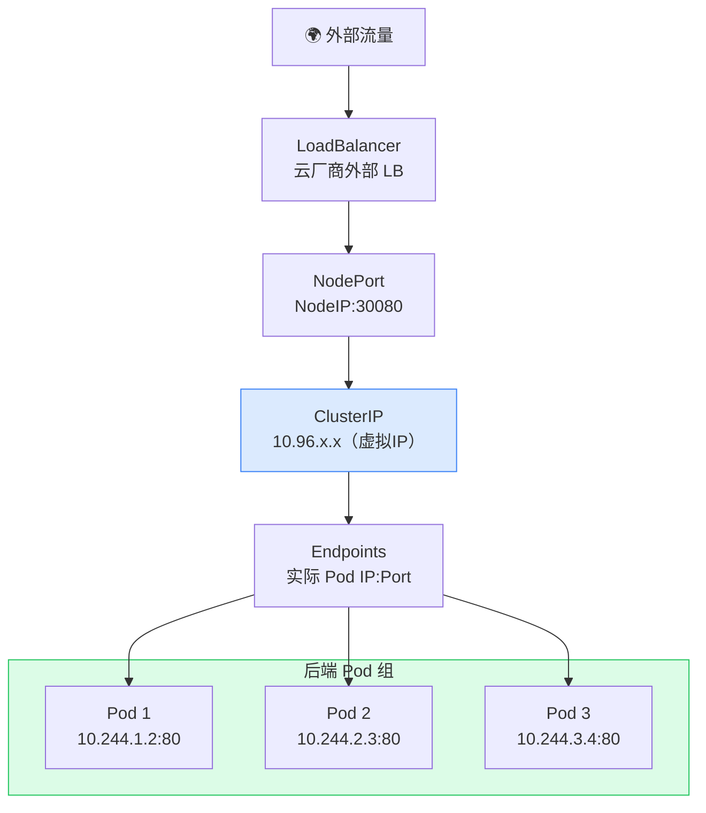

| 类型 | 访问范围 | 典型用途 |
|------|---------|---------|
| `ClusterIP`（默认） | 仅集群内部 | 服务间内部通信 |
| `NodePort` | 集群外部通过 NodeIP:NodePort | 测试/小规模暴露（30000-32767）|
| `LoadBalancer` | 云厂商提供外部 LB 接入 | 生产环境外部访问 |
| `ExternalName` | 将 Service 映射到外部域名 | 访问集群外服务（CNAME） |
| `Headless`（`clusterIP: None`） | 直接 DNS 解析到 Pod | StatefulSet / 服务发现 |

#### 4.1.2 Service YAML 示例

```yaml
apiVersion: v1
kind: Service
metadata:
  name: nginx-svc
spec:
  type: NodePort
  selector:
    app: nginx
  ports:
  - port: 80         # Service 端口
    targetPort: 80   # Pod 端口
    nodePort: 30080  # 节点端口（30000-32767）
```

### 4.2 Ingress

Ingress 提供**七层（HTTP/HTTPS）路由**能力：

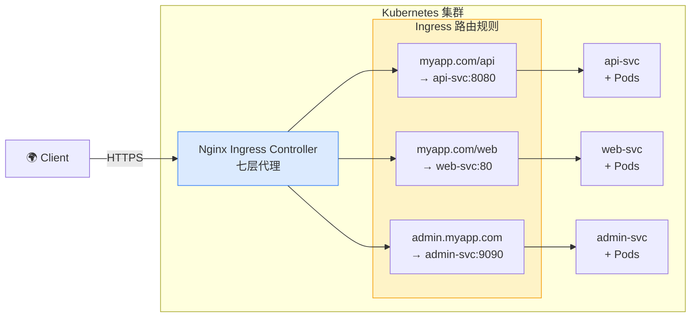

```yaml
apiVersion: networking.k8s.io/v1
kind: Ingress
metadata:
  name: my-ingress
  annotations:
    nginx.ingress.kubernetes.io/rewrite-target: /
spec:
  rules:
  - host: myapp.example.com
    http:
      paths:
      - path: /api
        pathType: Prefix
        backend:
          service:
            name: api-svc
            port:
              number: 8080
```

### 4.3 CoreDNS 服务名称解析

CoreDNS 是 K8s 集群内的 DNS 服务器，每个 Service 创建后自动获得 DNS 名称，Pod 可通过域名访问 Service，无需硬编码 IP。

#### DNS 命名规则

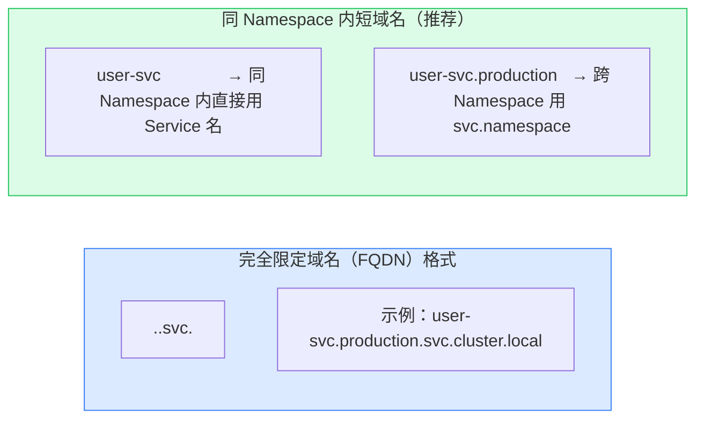

| 域名形式 | 适用场景 | 示例 |
|---------|---------|------|
| `<svc>` | 同 Namespace 内访问 | `http://user-svc:8080` |
| `<svc>.<ns>` | 跨 Namespace 访问 | `http://user-svc.production:8080` |
| `<svc>.<ns>.svc.cluster.local` | 完整 FQDN（跨集群配置） | `jdbc:mysql://mysql.db.svc.cluster.local:3306/mydb` |

#### StatefulSet Pod 的 DNS 名称

StatefulSet 配合 Headless Service 后，每个 Pod 都有独立 DNS，可直接点对点访问：

```
<pod-name>.<headless-svc>.<namespace>.svc.cluster.local

# 示例（mysql StatefulSet + headless svc: mysql）：
mysql-0.mysql.default.svc.cluster.local  → 主节点
mysql-1.mysql.default.svc.cluster.local  → 从节点1
mysql-2.mysql.default.svc.cluster.local  → 从节点2
```

#### Java 应用中的典型用法

```yaml
# application.yml（Spring Boot）—— 直接使用 Service 名，无需 IP
spring:
  datasource:
    url: jdbc:mysql://mysql-svc.default.svc.cluster.local:3306/mydb
  redis:
    host: redis-svc        # 同 Namespace 可简写
    port: 6379

# Feign / RestTemplate 调用其他微服务
# 服务名即 K8s Service 名（配合 Spring Cloud Kubernetes）
feign:
  client:
    config:
      order-service:        # 对应 order-service 这个 Service
        url: http://order-service:8080
```

<Aside type="tip" title="DNS 调试命令">
```bash
# 在 Pod 内验证 DNS 解析
kubectl run dns-test --image=busybox --restart=Never --rm -it --   nslookup user-svc.default.svc.cluster.local

# 查看 Pod 的 DNS 配置
kubectl exec -it <pod-name> -- cat /etc/resolv.conf
```
</Aside>

### 4.4 CNI 网络插件
 
| 插件 | 模式 | 特点 |
|------|------|------|
| **Flannel** | VXLAN Overlay | 简单易用，性能略低，适合入门 |
| **Calico** | BGP / IPIP | 高性能，支持 NetworkPolicy |
| **Cilium** | eBPF | 超高性能，支持 L7 策略，可观测性强 |
| **Weave Net** | Overlay | 支持加密，多云场景 |
 
### 4.5 NetworkPolicy
 
NetworkPolicy 是 K8s **网络防火墙**，控制 Pod 间通信（默认 Pod 间完全互通）：
 
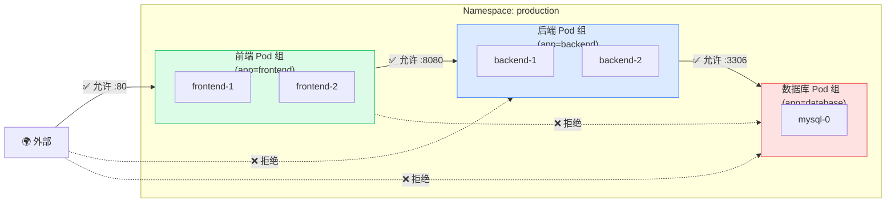
 
<Aside type="caution">
NetworkPolicy 需要 CNI 插件支持（Calico / Cilium），**Flannel 不支持** NetworkPolicy。
</Aside>
 
---

## 第五章 存储

### 5.1 Volume 类型速查

| Volume 类型 | 特点 | 典型场景 |
|------------|------|---------|
| `emptyDir` | 随 Pod 创建/删除，容器间共享 | 临时缓存、同 Pod 容器数据交换 |
| `hostPath` | 挂载宿主机目录 | Node 级日志/监控 Agent |
| `configMap` / `secret` | 挂载配置/密钥为文件 | 配置注入 |
| `nfs` | 挂载 NFS 共享目录 | 多 Pod 共享读写 |
| `PersistentVolumeClaim` | 绑定 PV 使用持久存储 | 数据库、有状态应用 |

### 5.2 PV / PVC 生命周期

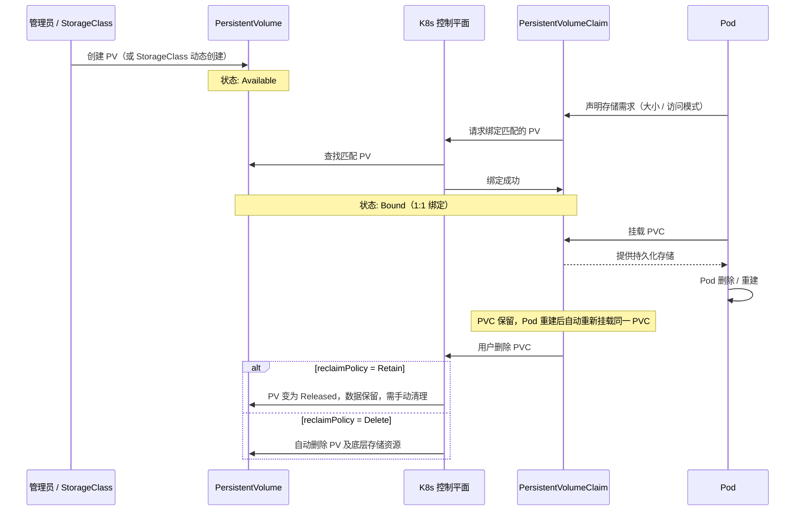

### 5.3 访问模式（accessModes）

| 访问模式 | 缩写 | 含义 |
|---------|------|------|
| `ReadWriteOnce` | RWO | 单节点读写（大多数块存储） |
| `ReadOnlyMany` | ROX | 多节点只读 |
| `ReadWriteMany` | RWX | 多节点读写（NFS / CephFS） |
| `ReadWriteOncePod` | RWOP | 仅单个 Pod 读写（K8s 1.22+） |

### 5.4 StorageClass 动态供给

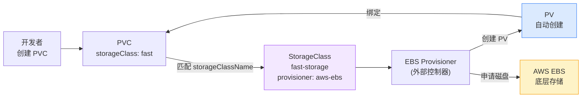

```yaml
apiVersion: storage.k8s.io/v1
kind: StorageClass
metadata:
  name: fast-storage
provisioner: kubernetes.io/aws-ebs
parameters:
  type: gp2
reclaimPolicy: Retain
allowVolumeExpansion: true
```

---

## 第六章 配置与密钥管理

### 6.1 ConfigMap

ConfigMap 存储**非敏感**的键值配置，与镜像解耦：

```bash
# 从字面值创建
kubectl create configmap app-config --from-literal=DB_HOST=mysql --from-literal=PORT=3306

# 从文件创建
kubectl create configmap app-config --from-file=./config.properties
```

**在 Pod 中使用：**

<Tabs>
<TabItem label="环境变量注入">
```yaml
env:
- name: DB_HOST
  valueFrom:
    configMapKeyRef:
      name: app-config
      key: DB_HOST
```
</TabItem>
<TabItem label="Volume 挂载（文件形式）">
```yaml
volumes:
- name: config-vol
  configMap:
    name: app-config
volumeMounts:
- name: config-vol
  mountPath: /etc/config
```
</TabItem>
<TabItem label="envFrom 全量注入">
```yaml
envFrom:
- configMapRef:
    name: app-config
```
</TabItem>
</Tabs>

### 6.2 Secret

Secret 存储敏感信息，**Base64 编码**存储（注意：不是加密！）：

| Secret 类型 | 用途 |
|------------|------|
| `Opaque`（默认） | 任意 Key-Value 数据 |
| `kubernetes.io/tls` | TLS 证书（Ingress 使用） |
| `kubernetes.io/dockerconfigjson` | 私有镜像仓库认证 |
| `kubernetes.io/service-account-token` | ServiceAccount Token |

#### 创建 Secret

```bash
# 方式1：命令行创建 Opaque Secret
kubectl create secret generic db-secret \
  --from-literal=username=admin \
  --from-literal=password=P@ssw0rd

# 方式2：从文件创建（key 名为文件名）
kubectl create secret generic tls-secret \
  --from-file=tls.crt=./server.crt \
  --from-file=tls.key=./server.key

# 方式3：TLS 类型（Ingress 证书专用）
kubectl create secret tls my-tls \
  --cert=server.crt --key=server.key

# 方式4：私有镜像仓库认证
kubectl create secret docker-registry regcred \
  --docker-server=registry.example.com \
  --docker-username=user \
  --docker-password=P@ssw0rd

# 查看 Secret（值为 Base64，用 -o jsonpath 解码）
kubectl get secret db-secret -o jsonpath='{.data.password}' | base64 -d
```

#### 在 Pod 中使用 Secret

<Tabs>
<TabItem label="环境变量注入">

```yaml
env:
- name: DB_PASSWORD
  valueFrom:
    secretKeyRef:
      name: db-secret
      key: password
```
</TabItem>
<TabItem label="Volume 挂载（文件）">
```yaml
# 每个 key 以文件名形式挂载到 mountPath 目录下
volumes:
- name: secret-vol
  secret:
    secretName: db-secret
    defaultMode: 0400     # 文件权限只读，安全加固
volumeMounts:
- name: secret-vol
  mountPath: /etc/secrets
  readOnly: true
```
</TabItem>
<TabItem label="envFrom 全量注入">
```yaml
# 将 Secret 中所有 key 注入为同名环境变量
envFrom:
- secretRef:
    name: db-secret
```
</TabItem>
<TabItem label="拉取私有镜像">
```yaml
spec:
  imagePullSecrets:
  - name: regcred      # docker-registry 类型 Secret 名称
  containers:
  - image: registry.example.com/myapp:1.0
```
</TabItem>
</Tabs>

<Aside type="danger" title="安全警告">
Secret 数据仅 Base64 编码，默认**明文存储在 etcd**，生产环境应开启 etcd 静态加密或使用 HashiCorp Vault 等外部方案。
</Aside>

---

## 第七章 调度机制

### 7.1 调度完整流程

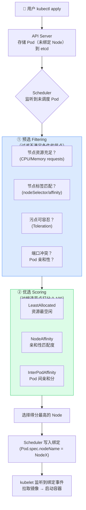

### 7.2 节点选择方式对比

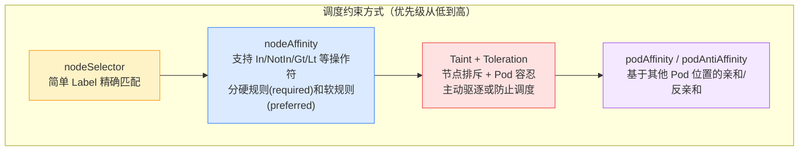

#### nodeSelector（简单精确匹配）

```bash
# 给节点打 Label
kubectl label node node1 disktype=ssd
kubectl label node node2 disktype=hdd
```

```yaml
spec:
  nodeSelector:
    disktype: ssd    # 只调度到含此 Label 的节点
```

#### nodeAffinity（灵活规则）

```yaml
spec:
  affinity:
    nodeAffinity:
      # 硬规则：必须满足（等价于 nodeSelector，但支持丰富操作符）
      requiredDuringSchedulingIgnoredDuringExecution:
        nodeSelectorTerms:
        - matchExpressions:
          - key: kubernetes.io/arch
            operator: In          # 支持: In / NotIn / Exists / DoesNotExist / Gt / Lt
            values: [amd64, arm64]
          - key: node-role
            operator: NotIn
            values: [gpu-only]
      # 软规则：尽量满足，不满足也可调度（weight 越高权重越大）
      preferredDuringSchedulingIgnoredDuringExecution:
      - weight: 80
        preference:
          matchExpressions:
          - key: disktype
            operator: In
            values: [ssd]
      - weight: 20
        preference:
          matchExpressions:
          - key: zone
            operator: In
            values: [cn-hangzhou-a]
```

#### podAntiAffinity（高可用打散副本）

```yaml
# 生产最佳实践：将多个副本强制分散到不同 Node
spec:
  affinity:
    podAntiAffinity:
      # 硬规则：同一 topologyKey（同一 Node）上不能有相同 Label 的 Pod
      requiredDuringSchedulingIgnoredDuringExecution:
      - labelSelector:
          matchLabels:
            app: my-app       # 与自身 Pod 的 Label 一致
        topologyKey: kubernetes.io/hostname   # 以 Node 为隔离粒度
      # 软规则：尽量分散到不同可用区
      preferredDuringSchedulingIgnoredDuringExecution:
      - weight: 100
        podAffinityTerm:
          labelSelector:
            matchLabels:
              app: my-app
          topologyKey: topology.kubernetes.io/zone  # 以可用区为隔离粒度
```

<Aside type="tip" title="topologyKey 常用值">
- `kubernetes.io/hostname`：以节点为粒度隔离（最常用，防止同 Node 单点）
- `topology.kubernetes.io/zone`：以可用区为粒度（多 AZ 高可用）
- `topology.kubernetes.io/region`：以地域为粒度（跨地域容灾）
</Aside>

### 7.3 污点（Taint）与容忍（Toleration）

```bash
# 给节点打污点
kubectl taint node node1 key=value:NoSchedule
kubectl taint node node1 key=value:NoExecute
kubectl taint node node1 key=value:PreferNoSchedule

# 删除污点
kubectl taint node node1 key=value:NoSchedule-
```

| Effect | 含义 |
|--------|------|
| `NoSchedule` | 不调度不容忍该污点的 Pod（已运行的不受影响） |
| `PreferNoSchedule` | 尽量不调度，无法满足时仍可调度 |
| `NoExecute` | 驱逐已运行的不容忍该污点的 Pod，且不再调度 |

```yaml
# Pod 配置容忍示例
tolerations:
- key: 'key'
  operator: 'Equal'
  value: 'value'
  effect: 'NoSchedule'
```

### 7.4 资源 QoS 等级

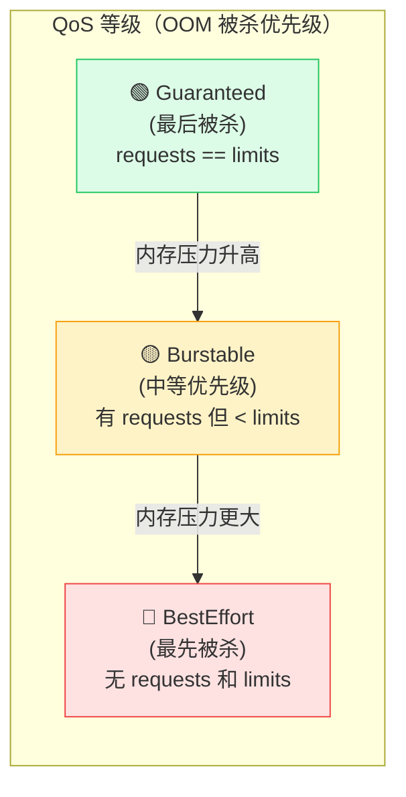

<Aside type="tip">
生产环境所有容器都应设置 `requests` 和 `limits`，追求 **Guaranteed** 级别，避免被意外 OOM 杀死。
</Aside>

---

## 第八章 RBAC 权限控制

### 8.1 RBAC 核心模型

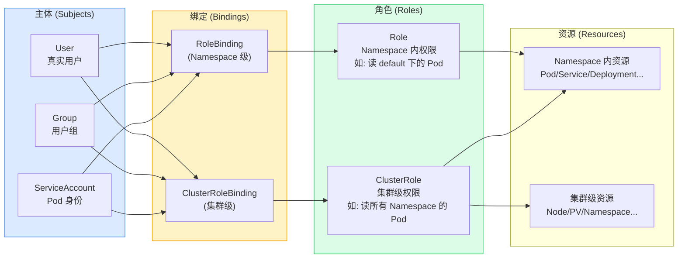

### 8.2 RBAC YAML 完整示例

```yaml
# 1. 创建 ServiceAccount
apiVersion: v1
kind: ServiceAccount
metadata:
  name: my-sa
  namespace: default
---
# 2. 创建 Role（只允许读 Pod）
apiVersion: rbac.authorization.k8s.io/v1
kind: Role
metadata:
  name: pod-reader
rules:
- apiGroups: ['']
  resources: ['pods']
  verbs: ['get', 'watch', 'list']
---
# 3. RoleBinding：将 Role 绑定到 ServiceAccount
apiVersion: rbac.authorization.k8s.io/v1
kind: RoleBinding
metadata:
  name: read-pods
subjects:
- kind: ServiceAccount
  name: my-sa
  namespace: default
roleRef:
  kind: Role
  name: pod-reader
  apiGroup: rbac.authorization.k8s.io
```

#### 常用 verbs 与资源 apiGroups 参考

| 操作 | verbs |
|------|-------|
| 只读权限 | `get`, `list`, `watch` |
| 读写权限 | `get`, `list`, `watch`, `create`, `update`, `patch`, `delete` |
| 全部权限 | `*` |

| 资源类型 | apiGroups |
|---------|-----------|
| Pod / Service / ConfigMap / Secret / PVC | `""` （空字符串，core API） |
| Deployment / StatefulSet / DaemonSet / ReplicaSet | `"apps"` |
| Job / CronJob | `"batch"` |
| Ingress / NetworkPolicy | `"networking.k8s.io"` |
| HPA | `"autoscaling"` |
| RBAC 资源本身 | `"rbac.authorization.k8s.io"` |

### 8.3 权限验证：kubectl auth can-i

```bash
# 检查当前用户是否有某项权限
kubectl auth can-i get pods                         # 是否可以读 Pod
kubectl auth can-i create deployments               # 是否可以创建 Deployment
kubectl auth can-i delete pods -n production        # 在指定 Namespace 下
kubectl auth can-i '*' '*'                          # 是否有所有权限（是否是管理员）

# 代入指定 ServiceAccount 检查其权限（--as 模拟身份）
kubectl auth can-i get pods --as=system:serviceaccount:default:my-sa
kubectl auth can-i list secrets --as=system:serviceaccount:default:my-sa -n default

# 列出当前身份在某 Namespace 下的所有权限
kubectl auth can-i --list -n default
kubectl auth can-i --list --as=system:serviceaccount:default:my-sa
```

<Aside type="tip">
`kubectl auth can-i` 是排查权限问题的首选工具，常用于调试 `Forbidden` 错误时快速定位缺失的权限配置。
</Aside>

---

## 第九章 Namespace 与资源配额

### 9.1 Namespace 隔离模型

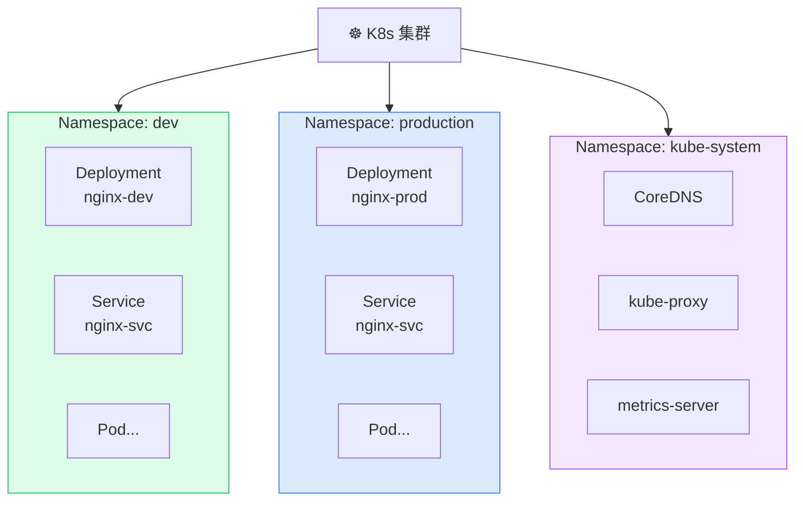

```bash
kubectl create namespace dev
kubectl get pods -n dev
kubectl get pods --all-namespaces   # 或 -A
kubectl config set-context --current --namespace=dev  # 切换默认 Namespace
```

### 9.2 ResourceQuota

```yaml
apiVersion: v1
kind: ResourceQuota
metadata:
  name: dev-quota
  namespace: dev
spec:
  hard:
    pods: '50'
    requests.cpu: '10'
    requests.memory: 20Gi
    limits.cpu: '20'
    limits.memory: 40Gi
    persistentvolumeclaims: '20'
```

### 9.3 LimitRange（容器默认资源）

```yaml
apiVersion: v1
kind: LimitRange
metadata:
  name: dev-limits
  namespace: dev
spec:
  limits:
  - type: Container
    default:          # 未设置 limits 时的默认值
      cpu: '500m'
      memory: 256Mi
    defaultRequest:   # 未设置 requests 时的默认值
      cpu: '100m'
      memory: 128Mi
    max:              # 上限约束
      cpu: '2'
      memory: 2Gi
```

---

## 第十章 kubectl 命令速查

### 10.1 资源操作

```bash
# 查看资源
kubectl get <resource> [-n <ns>] [-o wide|yaml|json]
kubectl describe <resource> <name>
kubectl explain <resource>.<field>

# 创建/应用
kubectl apply -f <file.yaml>
kubectl create -f <file.yaml>

# 删除
kubectl delete -f <file.yaml>
kubectl delete <resource> <name>
kubectl delete pod --all -n dev

# 编辑（直接修改线上资源）
kubectl edit <resource> <name>

# 扩缩容
kubectl scale deployment nginx --replicas=5
```

### 10.2 调试排查

```bash
# 查看日志
kubectl logs <pod-name>
kubectl logs <pod-name> -c <container-name>   # 多容器 Pod
kubectl logs -f <pod-name>                    # 实时跟踪
kubectl logs --previous <pod-name>            # 查看上次崩溃日志

# 进入容器
kubectl exec -it <pod-name> -- /bin/bash
kubectl exec -it <pod-name> -c <container> -- /bin/sh

# 端口转发（本地调试，不经过 Service）
kubectl port-forward pod/<pod-name> 8080:80
kubectl port-forward svc/<svc-name> 8080:80

# 查看事件（排查问题第一步！）
kubectl get events -n default --sort-by=.metadata.creationTimestamp
kubectl describe pod <pod-name>               # Events 在最后

# 资源使用情况
kubectl top node
kubectl top pod --all-namespaces
```

### 10.3 节点管理

```bash
# 标记节点不可调度（维护前）
kubectl cordon <node-name>

# 驱逐节点上所有 Pod（维护）
kubectl drain <node-name> --ignore-daemonsets --delete-emptydir-data

# 恢复节点可调度
kubectl uncordon <node-name>

# 给节点打 Label
kubectl label node <node-name> disktype=ssd

# 给节点打 Taint
kubectl taint node <node-name> key=value:NoSchedule
```

### 10.4 上下文管理

```bash
kubectl config get-contexts
kubectl config use-context <context-name>
kubectl config current-context
kubectl config set-context --current --namespace=dev
```

---

## 第十一章 集群搭建（kubeadm）

### 11.1 环境要求

| 要求 | 说明 |
|------|------|
| 操作系统 | CentOS 7.5+ / Ubuntu 20.04+ |
| 内存 | Master ≥ 2G，Worker ≥ 1G |
| CPU | Master ≥ 2 核，Worker ≥ 1 核 |
| 主机名 | 唯一且能互相解析（配置 /etc/hosts） |
| 时间同步 | ntp / chrony 确保时钟一致 |
| 关闭 Swap | kubelet 默认检测并要求关闭 |
| 防火墙 | 关闭 firewalld 或放开相关端口 |

### 11.2 安装流程

```mermaid
flowchart LR
    subgraph All["所有节点"]
        A1["① 关闭 SELinux\nSwap，配置主机名"]
        A2["② 安装 containerd\n配置 cgroup = systemd"]
        A3["③ 安装 kubeadm\nkubelet、kubectl"]
    end

    subgraph Master["仅 Master 节点"]
        M1["④ kubeadm init\n初始化控制平面"]
        M2["⑤ 配置 kubectl\n拷贝 admin.conf"]
        M3["⑥ 安装 CNI\n(Flannel/Calico)"]
    end

    subgraph Worker["Worker 节点"]
        W1["⑦ kubeadm join\n加入集群"]
    end

    All --> Master --> Worker

    style All fill:#dbeafe,stroke:#3b82f6
    style Master fill:#dcfce7,stroke:#22c55e
    style Worker fill:#fef3c7,stroke:#f59e0b
```

#### 步骤1：所有节点前置初始化（CentOS 示例）

```bash
# ─── 关闭防火墙 ───────────────────────────────────────────────────────────────
systemctl stop firewalld && systemctl disable firewalld

# ─── 关闭 SELinux ─────────────────────────────────────────────────────────────
setenforce 0
sed -i 's/^SELINUX=enforcing/SELINUX=disabled/' /etc/selinux/config

# ─── 关闭 Swap（K8s 强制要求）─────────────────────────────────────────────────
swapoff -a
sed -ri 's/.*swap.*/#&/' /etc/fstab   # 注释掉 /etc/fstab 中的 swap 行（永久生效）

# ─── 配置主机名与 hosts 解析 ──────────────────────────────────────────────────
hostnamectl set-hostname master-01     # 在每个节点分别执行，修改为对应主机名
cat >> /etc/hosts << EOF
192.168.1.100  master-01
192.168.1.101  worker-01
192.168.1.102  worker-02
EOF

# ─── 时间同步 ─────────────────────────────────────────────────────────────────
yum install -y chrony
systemctl enable --now chronyd

# ─── 内核参数配置（网络转发、bridge-netfilter）────────────────────────────────
cat > /etc/modules-load.d/k8s.conf << EOF
overlay
br_netfilter
EOF
modprobe overlay && modprobe br_netfilter

cat > /etc/sysctl.d/k8s.conf << EOF
net.bridge.bridge-nf-call-iptables  = 1
net.bridge.bridge-nf-call-ip6tables = 1
net.ipv4.ip_forward                 = 1
EOF
sysctl --system    # 立即生效
```

#### 步骤2：安装 containerd（所有节点）

```bash
yum install -y yum-utils
yum-config-manager --add-repo https://download.docker.com/linux/centos/docker-ce.repo
yum install -y containerd.io

# 生成默认配置并修改 cgroup driver 为 systemd（与 kubelet 保持一致）
containerd config default > /etc/containerd/config.toml
sed -i 's/SystemdCgroup = false/SystemdCgroup = true/' /etc/containerd/config.toml
# 配置镜像加速（国内环境）
sed -i 's|config_path = ""|config_path = "/etc/containerd/certs.d"|' /etc/containerd/config.toml

systemctl enable --now containerd
```

#### 步骤3：安装 kubeadm / kubelet / kubectl（所有节点）

```bash
cat > /etc/yum.repos.d/kubernetes.repo << EOF
[kubernetes]
name=Kubernetes
baseurl=https://mirrors.aliyun.com/kubernetes/yum/repos/kubernetes-el7-x86_64/
enabled=1
gpgcheck=0
EOF

yum install -y kubelet-1.28.0 kubeadm-1.28.0 kubectl-1.28.0
systemctl enable kubelet   # 启用但先不 start（kubeadm init 会自动拉起）
```

#### 步骤4：Master 节点初始化

```bash
# kubeadm init（使用阿里云镜像加速）
kubeadm init \
  --apiserver-advertise-address=192.168.1.100 \
  --image-repository registry.aliyuncs.com/google_containers \
  --kubernetes-version v1.28.0 \
  --service-cidr=10.96.0.0/12 \
  --pod-network-cidr=10.244.0.0/16

# 配置 kubectl 凭证
mkdir -p $HOME/.kube
sudo cp -i /etc/kubernetes/admin.conf $HOME/.kube/config
sudo chown $(id -u):$(id -g) $HOME/.kube/config

# 安装 Flannel 网络插件
kubectl apply -f https://raw.githubusercontent.com/flannel-io/flannel/master/Documentation/kube-flannel.yml

# 验证 Master 就绪
kubectl get nodes    # STATUS 应为 Ready
kubectl get pods -n kube-system    # 所有 Pod 应为 Running
```

#### 步骤5：Worker 节点加入集群

```bash
# kubeadm init 完成后会输出 join 命令，直接复制执行（Token 24 小时有效）
kubeadm join 192.168.1.100:6443 \
  --token <token> \
  --discovery-token-ca-cert-hash sha256:<hash>

# 若 Token 过期，在 Master 重新生成
kubeadm token create --print-join-command
```

#### 步骤6：验证集群

```bash
kubectl get nodes -o wide           # 所有节点 Ready
kubectl get pods -A                 # 所有系统 Pod Running
kubectl run test --image=nginx --restart=Never
kubectl get pod test                # Pod 正常运行则集群就绪
kubectl delete pod test
```

---

## 第十二章 常见问题与故障排查

### 12.1 排查思路

```mermaid
flowchart TD
    Start["🚨 Pod 异常"]
    S1["kubectl get pod\n查看 Pod 状态"]
    S2{"状态正常？"}
    S3["kubectl describe pod\n查看 Events（最关键！）"]
    S4["kubectl logs\n查看容器日志"]
    S5["kubectl logs --previous\n查看崩溃前日志"]
    S6["kubectl exec -it\n进容器排查"]
    S7["kubectl get events\n查看全局事件"]
    Solved["✅ 问题定位"]

    Start --> S1 --> S2
    S2 -->|"Pending/Error"| S3
    S3 -->|"容器崩溃"| S5
    S3 -->|"运行中但异常"| S4
    S4 -->|"需要进一步排查"| S6
    S2 -->|"Ready 但服务不通"| S7
    S5 & S6 & S7 --> Solved

    style Solved fill:#dcfce7,stroke:#22c55e
    style Start fill:#fee2e2,stroke:#ef4444
```

### 12.2 常见问题速查

| 现象 | 可能原因 | 解决思路 |
|------|---------|---------|
| `Pending` | 无满足条件的 Node（资源不足/污点/亲和性） | `kubectl describe pod` 看 Events，检查资源/标签/污点 |
| `CrashLoopBackOff` | 容器启动后立即退出 | `kubectl logs --previous` 查退出日志 |
| `ImagePullBackOff` | 镜像拉取失败 | 检查镜像名/Tag/网络/私有仓库 Secret |
| `OOMKilled` | 内存超 limits | 调大 `limits.memory` 或优化应用 |
| `Evicted` | Node 资源紧张被驱逐 | 检查 Node 资源，清理无用 Pod/PVC |
| Service 无法访问 | Selector 不匹配 / Pod 未就绪 | `kubectl get endpoints` 检查是否有 IP |
| DNS 解析失败 | CoreDNS 问题 | `kubectl get pods -n kube-system` 检查 CoreDNS 状态 |
| Node NotReady | kubelet 未运行 / 网络插件故障 | `systemctl status kubelet`，检查 CNI 插件 Pod 状态 |
| Pod 一直 Terminating | 节点失联或 finalizer 阻塞 | `kubectl delete pod --force --grace-period=0` 强制删除 |

#### 12.3 Service 网络不通排查步骤

```bash
# 1. 确认 Service 存在且 Selector 正确
kubectl get svc my-svc -o yaml | grep -A5 selector

# 2. 确认 Endpoints 有 Pod IP（如果为空说明 Selector 不匹配或 Pod 未 Ready）
kubectl get endpoints my-svc

# 3. 确认 Pod 的 readinessProbe 通过
kubectl describe pod <pod-name> | grep -A10 Conditions

# 4. 在集群内用 busybox 测试连通性
kubectl run curl-test --image=curlimages/curl --restart=Never --rm -it -- \
  curl http://my-svc.default.svc.cluster.local:80

# 5. 检查 kube-proxy 是否正常运行
kubectl get pods -n kube-system | grep kube-proxy
kubectl logs -n kube-system kube-proxy-<hash>

# 6. 检查 iptables 规则是否生成（IPVS 模式用 ipvsadm -Ln）
iptables -t nat -L KUBE-SERVICES | grep my-svc
```

---

## 第十三章 Helm 包管理器

### 13.1 Helm 核心概念

Helm 是 K8s 的**包管理器**，类比 Java 生态中的 Maven。四个核心概念：

| 概念 | Java 类比 | 说明 |
|------|-----------|------|
| **Chart** | `pom.xml` + 所有源码 | K8s 应用描述包，含 YAML 模板集合 |
| **Repository** | Maven 中央仓库 | 存储和分发 Chart 的仓库（ArtifactHub） |
| **Values** | `application.properties` | Chart 的可配置参数，支持多层覆盖 |
| **Release** | 部署的 jar 实例 | Chart 在集群中的一次具体部署，可多次安装同一 Chart |

#### Helm 完整工作流

```mermaid
flowchart LR
    subgraph Dev["👨‍💻 开发者"]
        HC["helm create\n脚手架生成 Chart"]
        HP["helm package\n打包为 .tgz"]
        HT["helm template\n本地渲染预览"]
    end

    subgraph Repo["🏪 Chart Repository"]
        ChartTGZ["📦 nginx-1.2.0.tgz"]
    end

    subgraph Cluster["☸️ K8s 集群"]
        Values["⚙️ values.yaml\n+ --values f.yaml\n+ --set key=val"]
        Engine["Go Template 渲染引擎"]
        Manifest["最终 Manifest YAML"]
        Release1["Release: nginx-prod"]
        Release2["Release: nginx-staging"]
    end

    HC --> HP --> Repo
    Repo -->|"helm repo add / pull"| Engine
    Values --> Engine
    Engine --> Manifest
    Manifest -->|"helm install"| Release1
    Manifest -->|"helm install"| Release2
    HT -.->|"预览不部署"| Manifest

    style Dev fill:#fef3c7,stroke:#f59e0b
    style Repo fill:#f3e8ff,stroke:#a855f7
    style Values fill:#fef3c7,stroke:#f59e0b
    style Release1 fill:#dcfce7,stroke:#22c55e
    style Release2 fill:#dcfce7,stroke:#22c55e
```

#### Chart 目录结构

```text
mychart/
├── Chart.yaml          # Chart 元数据（名称、版本、描述、依赖声明）
├── values.yaml         # 默认配置值（可被多层覆盖）
├── charts/             # 依赖的子 Chart（helm dependency update 拉取）
├── templates/          # Go Template YAML 模板文件
│   ├── deployment.yaml
│   ├── service.yaml
│   ├── ingress.yaml
│   ├── _helpers.tpl    # 可复用的命名模板片段（不直接渲染为资源）
│   └── NOTES.txt       # helm install 后打印的使用说明
└── .helmignore         # 打包时忽略的文件（同 .gitignore）
```

#### Values 覆盖优先级（从低到高）

```mermaid
graph LR
    V1["① Chart 内\nvalues.yaml\n默认值"]
    V2["② 父 Chart\nvalues.yaml\n子 Chart 覆盖"]
    V3["③ --values / -f\noverride.yaml\n文件覆盖"]
    V4["④ --set key=val\n命令行最高优先级"]

    V1 -->|"被覆盖"| V2 -->|"被覆盖"| V3 -->|"被覆盖"| V4

    style V1 fill:#f3f4f6,stroke:#9ca3af
    style V2 fill:#fef3c7,stroke:#f59e0b
    style V3 fill:#dbeafe,stroke:#3b82f6
    style V4 fill:#dcfce7,stroke:#22c55e
```

### 13.2 常用命令

```bash
# ── 仓库管理 ───────────────────────────────────────────────
helm repo add bitnami https://charts.bitnami.com/bitnami
helm repo update
helm search repo mysql           # 搜索仓库中的 Chart
helm search hub nginx            # 搜索 ArtifactHub 公共 Chart

# ── 安装 / 升级 ────────────────────────────────────────────
helm install my-nginx bitnami/nginx --set service.type=NodePort
helm install my-nginx bitnami/nginx -n prod --create-namespace   # 指定/自动创建 Namespace
helm install my-nginx bitnami/nginx -f custom-values.yaml        # 指定 values 文件
helm upgrade my-nginx bitnami/nginx --set replicaCount=3
helm upgrade --install my-nginx bitnami/nginx -f values.yaml     # 幂等：不存在则安装

# ── 查看 ───────────────────────────────────────────────────
helm list                        # 列出所有 Release
helm list -n prod                # 指定 Namespace
helm status my-nginx             # 查看 Release 状态与 NOTES
helm get values my-nginx         # 查看实际生效的 values
helm get manifest my-nginx       # 查看渲染后的 K8s YAML
helm history my-nginx            # 查看 Release 历史版本

# ── 回退 / 卸载 ────────────────────────────────────────────
helm rollback my-nginx 1         # 回退到指定版本号
helm uninstall my-nginx          # 卸载 Release（删除所有相关 K8s 资源）

# ── Chart 开发 ─────────────────────────────────────────────
helm create mychart              # 脚手架生成 Chart 目录
helm lint mychart/               # 语法检查（CI 必备）
helm template mychart/ -f values.yaml  # 本地渲染预览，不部署（用于 CI 校验）
helm package mychart/            # 打包为 mychart-0.1.0.tgz
helm dependency update mychart/  # 拉取 Chart.yaml 中声明的依赖子 Chart
```

---

## 第十四章 生产最佳实践

### 14.1 镜像最佳实践

- 使用**精确的镜像 Tag**（避免 `latest`，不可追溯，会导致 Pod 重建时版本不一致）
- 设置 `imagePullPolicy: Always`（生产环境）或 `IfNotPresent`（可接受缓存）
- 使用**多阶段构建**减小镜像体积，避免泄露源码
- 使用**非 root 用户**运行容器（安全加固）

### 14.2 资源管理

- 所有容器**必须**设置 `requests` 和 `limits`，避免 BestEffort 级别 Pod
- 通过 `LimitRange` 防止忘记设置资源限制
- 配置 `ResourceQuota` 限制 Namespace 资源总量
- 关键服务设置 `PodDisruptionBudget`（PDB），保证滚动更新时最少副本数

```yaml
# PodDisruptionBudget 示例：任何时刻至少保证 2 个 Pod 可用
apiVersion: policy/v1
kind: PodDisruptionBudget
metadata:
  name: my-app-pdb
spec:
  minAvailable: 2       # 或用 maxUnavailable: 1（二选一）
  selector:
    matchLabels:
      app: my-app       # 与 Deployment 的 Pod Labels 对应
```

<Aside type="tip">
PDB 在 `kubectl drain`（节点维护）时生效：若驱逐会导致可用副本低于 `minAvailable`，drain 操作会被阻塞，保护生产服务不中断。
</Aside>

### 14.3 高可用架构

```mermaid
graph TB
    subgraph HA["高可用 K8s 生产集群"]
        subgraph Masters["Master 节点（3 个）"]
            M1["Master-1\n(Active)"]
            M2["Master-2\n(Standby)"]
            M3["Master-3\n(Standby)"]
        end

        subgraph ETCD["etcd 集群（3 节点）"]
            E1["etcd-1"]
            E2["etcd-2"]
            E3["etcd-3"]
        end

        subgraph Workers["Worker 节点（多个）"]
            W1["Node-1\nZone A"]
            W2["Node-2\nZone B"]
            W3["Node-3\nZone C"]
        end

        subgraph Pods["应用 Pod（podAntiAffinity 分散）"]
            P1["App-v2-0\n(Node-1)"]
            P2["App-v2-1\n(Node-2)"]
            P3["App-v2-2\n(Node-3)"]
        end
    end

    LB["外部负载均衡器\n(VIP)"] --> M1 & M2 & M3
    M1 & M2 & M3 <--> E1 & E2 & E3
    Masters --> W1 & W2 & W3
    W1 --> P1
    W2 --> P2
    W3 --> P3

    style Masters fill:#dbeafe,stroke:#3b82f6
    style ETCD fill:#fee2e2,stroke:#ef4444
    style Workers fill:#dcfce7,stroke:#22c55e
    style Pods fill:#f3e8ff,stroke:#a855f7
```

### 14.4 安全加固 Checklist

- [ ] 开启 RBAC，遵循最小权限原则
- [ ] 不使用 default ServiceAccount，为每个应用创建专用 SA
- [ ] 开启 etcd 静态加密（Encryption at Rest）
- [ ] 使用 NetworkPolicy 限制 Pod 间通信
- [ ] 不在代码中硬编码密钥，使用 Secret 注入
- [ ] 设置 `securityContext`：非 root 用户、只读文件系统
- [ ] 定期更新 K8s 版本，修复已知 CVE
- [ ] 启用 Audit Log（审计日志）记录所有 API 操作

```yaml
# securityContext 安全加固完整示例
spec:
  securityContext:
    runAsNonRoot: true          # Pod 级别：禁止 root 运行
    runAsUser: 1000
    runAsGroup: 1000
    fsGroup: 2000               # 挂载卷的属组
    seccompProfile:
      type: RuntimeDefault      # 使用容器运行时默认 seccomp 策略（K8s 1.22+）
  containers:
  - name: app
    image: my-app:1.0
    securityContext:
      allowPrivilegeEscalation: false   # 禁止提权（最重要）
      readOnlyRootFilesystem: true      # 根文件系统只读，防止容器写入
      capabilities:
        drop: [ALL]                     # 丢弃所有 Linux Capabilities
        add: [NET_BIND_SERVICE]         # 仅按需添加（如需绑定 <1024 端口）
```

### 14.5 可观测性体系

```mermaid
graph LR
    subgraph Observability["可观测性三支柱"]
        subgraph Metrics["📊 Metrics（指标）"]
            prom["Prometheus\n采集 & 存储"]
            grafana["Grafana\n可视化面板"]
            alert["AlertManager\n告警通知"]
        end

        subgraph Logs["📄 Logs（日志）"]
            fb["Filebeat / Fluentd\n日志采集 DaemonSet"]
            es["Elasticsearch\n日志存储"]
            kibana["Kibana\n日志搜索"]
        end

        subgraph Traces["🔍 Traces（链路追踪）"]
            otel["OpenTelemetry\nSDK（Java Agent）"]
            jaeger["Jaeger / Zipkin\n链路可视化"]
        end
    end

    App["☕ Java 微服务"] --> otel & fb
    prom -->|"scrape metrics"| App
    prom --> grafana & alert
    fb --> es --> kibana
    otel --> jaeger

    style Metrics fill:#dbeafe,stroke:#3b82f6
    style Logs fill:#dcfce7,stroke:#22c55e
    style Traces fill:#f3e8ff,stroke:#a855f7
```

<Aside type="tip">
Java 应用推荐使用 **Micrometer** + Prometheus 暴露指标，链路追踪使用 **OpenTelemetry Java Agent** 自动埋点，无侵入接入。
</Aside>

---

## 附录 资源缩写速查

| 资源名 | 缩写 | API 版本 |
|--------|------|---------|
| Pod | `po` | `v1` |
| Service | `svc` | `v1` |
| Deployment | `deploy` | `apps/v1` |
| StatefulSet | `sts` | `apps/v1` |
| DaemonSet | `ds` | `apps/v1` |
| ReplicaSet | `rs` | `apps/v1` |
| ConfigMap | `cm` | `v1` |
| Secret | — | `v1` |
| Namespace | `ns` | `v1` |
| PersistentVolume | `pv` | `v1` |
| PersistentVolumeClaim | `pvc` | `v1` |
| StorageClass | `sc` | `storage.k8s.io/v1` |
| Ingress | `ing` | `networking.k8s.io/v1` |
| Node | `no` | `v1` |
| HorizontalPodAutoscaler | `hpa` | `autoscaling/v2` |
| Job | — | `batch/v1` |
| CronJob | `cj` | `batch/v1` |
| ServiceAccount | `sa` | `v1` |
| NetworkPolicy | `netpol` | `networking.k8s.io/v1` |

---

:::note[Starlight + Mermaid 集成说明]
本文档基于 [Astro Starlight](https://starlight.astro.build/) 框架编写。Mermaid 图表渲染需安装：

```bash
# 安装 rehype-mermaid 插件（推荐，输出 SVG 矢量图）
npm install rehype-mermaid

# astro.config.mjs 配置
import rehypeMermaid from 'rehype-mermaid';

export default defineConfig({
  integrations: [
    starlight({
      title: 'K8s 技术手册',
      markdown: {
        rehypePlugins: [rehypeMermaid],
      },
    }),
  ],
});
```
:::

本文档如有遗漏和错误，欢迎勘误！
